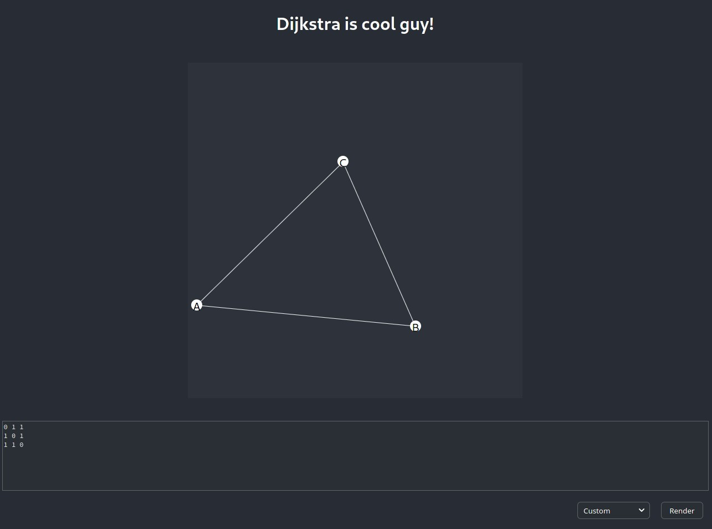

# PT Dijkstra
Dijkstra algorithm simulator running in browser.
It's simple, fast and extensible. Build on open technologies and with free license. Try it yourself!



## Running the app
Simply clone the repository and:
```
$ cd pt-dijkstra
$ yarn start
```
###### NOTE: You need to have `yarn` installed.

This should open your browser. At the moment we don't have a live demo.
The site is mobile friendly so it should work on any screen size.

## Graphs
Simulator provides few graphs you can try.
Additionaly inputting your own graphs is also possible.

We don't put a limit on graph sizes.
Software was tested on graphs with over 50 nodes and it worked smoothly.
The browser does the heavy lifting, so performance will highly depend on device used.

###### - Is there a way to save graphs?
###### - Of course! Right click on input field > Select all > Copy


## Used technologies
 - Typescript
 - React
 - yarn

Since we use Typescript compiler you won't be able to understand generated js looking at it in browser.

To debug react there is anan  extension available called "React developer tools" for most popular browsers.

ESLint was used to control coding style. It will generate warnings and errors in terminal after `yarn start` command if the code is not styled correctly.

## Hacking
Want to see how it is build? Or maybe you have different algorithm to show? Either way the code is here for you to modify.

### I don't know React
If you don't know how React works - no problem. Not everything is a React component. You will be more intersted in what's in `src/logic` folder.

### Changing algorithm
You will need to write your own algorithm in typescript. It needs to be a class implementing `Algorithm` interface (look in `src/logic/commonInterfaces.ts`). Next just change single line in `src/App.tsx` to use custom impementation.

### Changing how graph is animated/displayed
`graphFrames.ts` contains code processing results of algorithm and graph. It creates "frames" out of it.

`graphMapping.ts` is what places nodes on canvas.

## License
We use permissive license, so feel free to fork this project and use it however you like.
Redistributing or selling is even encouraged!